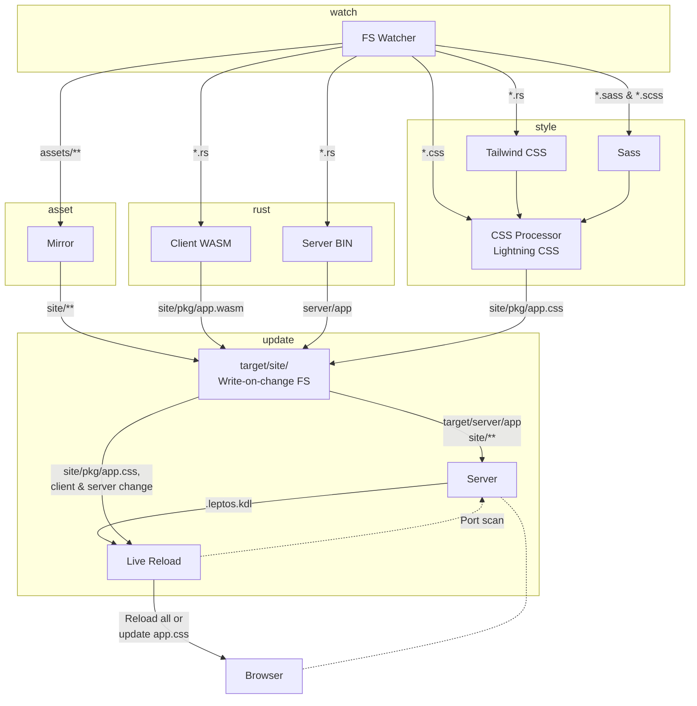

[](https://crates.io/crates/cargo-leptos)
[](https://discord.gg/YdRAhS7eQB)

# cargo-leptos

Build tool for [Leptos](https://crates.io/crates/leptos):

[](http://https://crates.io/crates/leptos)

<br/>

## Features

- Build server and client for hydration (client-side rendering mode not supported).
- SCSS compilation using [dart-sass](https://sass-lang.com/dart-sass).
- CSS transformation and minification using [Lightning CSS](https://lightningcss.dev). See docs for full details.
- Builds server and client (wasm) binaries using Cargo.
- Generates JS - Wasm bindings with [wasm-bindgen](https://crates.io/crates/wasm-bindgen)
- Optimises the wasm with _wasm-opt_ from [Binaryen](https://github.com/WebAssembly/binaryen)
- Generation of rust code for integrating with a server of choice.
- Standard mode for building full server and client.
- `watch` command for automatic rebuilds with browser live-reload.
- `test` command for running tests. Note that this runs `cargo test` for the two different modes (`hydrate` and `ssr`).
- `build` build the server and client.
- `end2end` command for building, running the server and calling a bash shell hook. The hook would typically launch Playwright or similar.
- `new` command for creating a new project based on templates, using [cargo-generate](https://cargo-generate.github.io/cargo-generate/index.html). WIP: You'll need to ask on the Leptos [discord](https://discord.gg/YdRAhS7eQB) for the url of a template.

  <br/>

## Getting started

Install:

> `cargo install --locked cargo-leptos`

If you for any reason needs the bleeding-edge super fresh version:

> `cargo install --git https://github.com/akesson/cargo-leptos cargo-leptos`

Help:

> `cargo leptos --help`

For setting up your project, base yourself on the [example](https://github.com/akesson/cargo-leptos/tree/main/example)

<br/>

## Configuration

The columns are in order of preference. I.e. a parameter found in an environment variable
will take precedence to a value found in _Cargo.toml_.

| parameter             | env <sup>1</sup>    | Cargo.toml                               | default <sup>2</sup> |
| --------------------- | ------------------- | ---------------------------------------- | -------------------- |
| **package_name**      | PACKAGE_NAME        | package.**name**                         |                      |
| **site_root**         | LEPTOS_SITE_ROOT    | package.metadata.leptos.**site_root**    | "target/site"        |
| **site_pkg_dir**      | LEPTOS_SITE_PKG_DIR | package.metadata.leptos.**site_pkg**     | "pkg"                |
| **style_file**        | LEPTOS_STYLE_FILE   | package.metadata.leptos.**style_file**   |                      |
| **assets_dir**        | LEPTOS_ASSETS_DIR   | package.metadata.leptos.**assets_dir**   |                      |
| **site_addr**         | LEPTOS_SITE_ADDR    | package.metadata.leptos.**site_addr**    | 127.0.0.1:3000       |
| **reload_port**       | LEPTOS_RELOAD_PORT  | package.metadata.leptos.**reload_port**  | 3000                 |
| **end2end_cmd**       | LEPTOS_END2END_CMD  | package.metadata.leptos.**end2end_cmd**  |                      |
| **browserquery**      | LEPTOS_BROWSERQUERY | package.metadata.leptos.**browserquery** | "defaults"           |
| **watch**<sup>3</sup> | LEPTOS_WATCH        |                                          |                      |

- <sup>1</sup> If environment var is found in a .env file it will be used with precedence over
  anything defined on the command line or in the shell.
- <sup>2</sup> When empty, the related feature is not activated.
- <sup>3</sup> Used by _cargo-leptos_: provided at compile-time and run-time when running in watch mode.

<br/>

### Overview

`cargo-leptos`

- compiles a client from sources found in the src folder to a `<package_name>.wasm` and a `<package_name>.js` in `<site_root>/<site_pkg_dir>/`.
- compiles a server binary from sources found in the src folder to the standard location (`target/[debug|release]/<package_name>`).
- compiles (if scss or sass) and optimises CSS from `<style_file>` to `<site_root>/<site_pkg_dir>/<package_name>.css`.
- mirrors any assets from `<assets_dir>` to `<site_root>/<site_pkg_dir>`.

<br />

### Parameters

- **package_name** <sup>r</sup><br/> The _Cargo.toml_ package name.
- **site_root**<br/> The site root folder is where _cargo-leptos_ generate all output.
  WARNING: all content of this folder will be erased on a rebuild. Use it in your server setup.
- **site_pkg** <sup>c</sup><br/> The **site_root** relative folder where all compiled output (JS, WASM and CSS) is written.
- **style_file**<br/> [optional] The source CSS file. If it ends with _.sass_ or _.scss_ then it will be compiled by `dart-sass` into CSS.
  The CSS is optimized by [Lightning CSS](https://lightningcss.dev) before being written to `<site_root>/<site_pkg>/app.css`
- **assets_dir** <br/> [optional] Assets source dir. All files found here will be copied and synchronized to **site_root**.
  The **assets_dir** should have a sub-directory with the same name/path as **site_pkg**.
- **site_addr** <sup>r</sup><br/> The IP and port (ex: _127.0.0.1:3000_) where the server serves the content. Use it in your server setup.
- **reload_port** <sup>c</sup><br/> The port number used by the reload server (only used in watch mode).
- **end2end_cmd**<br/> [optional] The command used for running integration tests. Typically: `npx playwright test`.
- **browserquery**<br/> The [browserlist](https://browsersl.ist) query used for optimizing the CSS.
- **watch** <sup>c</sup><br/> Set by _cargo-leptos_ when running in watch mode.

<sup>r.</sup> Set by _cargo-leptos_ at runtime and used by the server integrations.<br/>
<sup>c.</sup> Set by _cargo-leptos_ at compile time and used by the server integrations<br/>

<br/>

## Folder structure

```
├── src/
│ ├── app/             (the app logic)
│ ├── client/          (client packaging)
│ ├── server/          (the http server)
│ │ └── generated.rs   (generated by build)
│ ├── lib.rs
│ ├── app.scss         (root css/sass/scss file)
│ └── main.rs
│
├── static/
│ └── favicon.png
│
├── index.html         (template for generating the root page)
├── Cargo.toml         (needs the [package.metadata.leptos] config)
│
├── end2end/           (end-to-end test using Playwright)
│ ├── tests/
│ ├── playwright.config.ts
│ └── package.json
│
└── target/
  └── site/
    ├── index.html     (generated by build)
    ├── favicon.png
    └── pkg/
      ├── app.wasm
      ├── app.js
      └── app.css
```

# Tasks

## File view

This is mainly relevant for the `watch` mode.



## Concurrency view

Very approximate

```mermaid
stateDiagram-v2
    wasm: Build front
    bin: Build server
    style: Build style
    asset: Mirror assets
    serve: Run server

    state wait_for_start <<fork>>
      [*] --> wait_for_start
      wait_for_start --> wasm
      wait_for_start --> bin
      wait_for_start --> style
      wait_for_start --> asset

    reload: Reload
    state join_state <<join>>
      wasm --> join_state
      bin --> join_state
      style --> join_state
      asset --> join_state
    state if_state <<choice>>
        join_state --> if_state
        if_state --> reload: Ok
        if_state --> serve: Ok
        if_state --> [*] : Err
```
