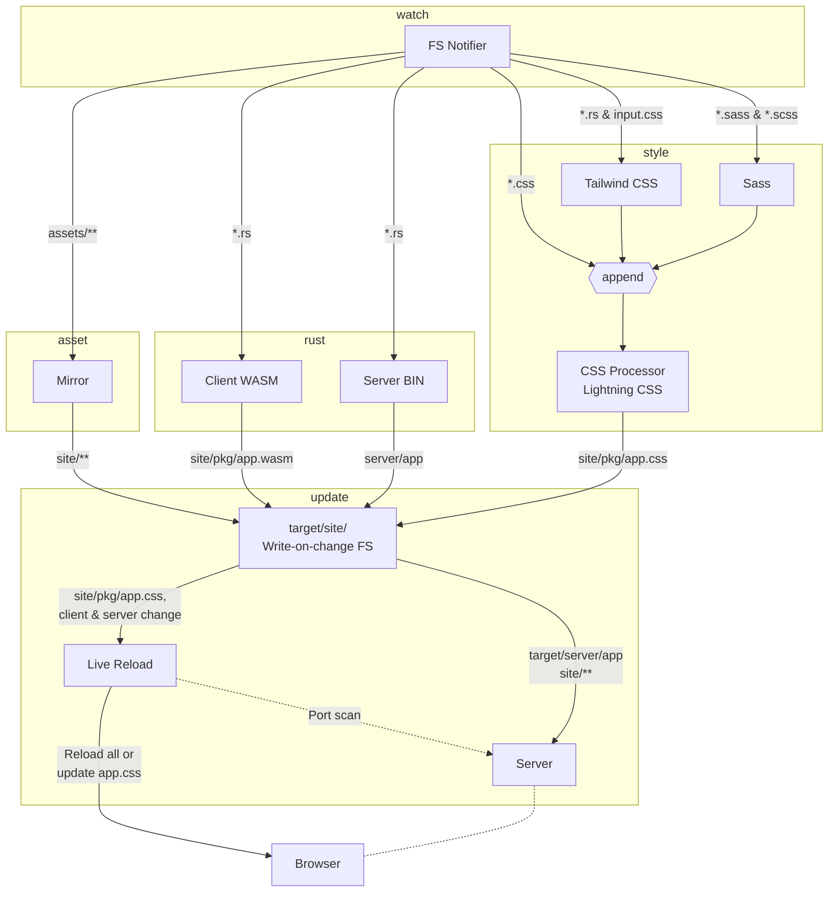

# Internals

## File view

This is mainly relevant for the `watch` mode.



## Concurrency view

Very approximate

```mermaid
stateDiagram-v2
    wasm: Build front
    bin: Build server
    style: Build style
    asset: Mirror assets
    serve: Run server

    state wait_for_start <<fork>>
      [*] --> wait_for_start
      wait_for_start --> wasm
      wait_for_start --> bin
      wait_for_start --> style
      wait_for_start --> asset

    reload: Reload
    state join_state <<join>>
      wasm --> join_state
      bin --> join_state
      style --> join_state
      asset --> join_state
    state if_state <<choice>>
        join_state --> if_state
        if_state --> reload: Ok
        if_state --> serve: Ok
        if_state --> [*] : Err
```
